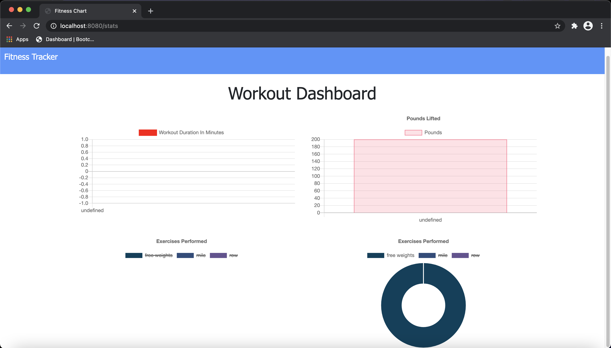
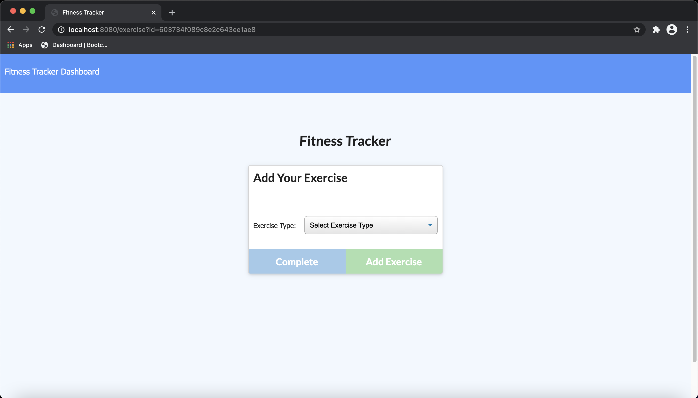

# workout-tracker

# Description of Project

For this assignment we were tasked with creating a web application that allowed a user to track their fitness workouts. For the database instead of using MySQL we used MongoDB.

# Links

Repo Page:
https://github.com/slimeforest/workout-tracker

Live Page:
https://workout-tracker98327592875.herokuapp.com

# Screenshots

